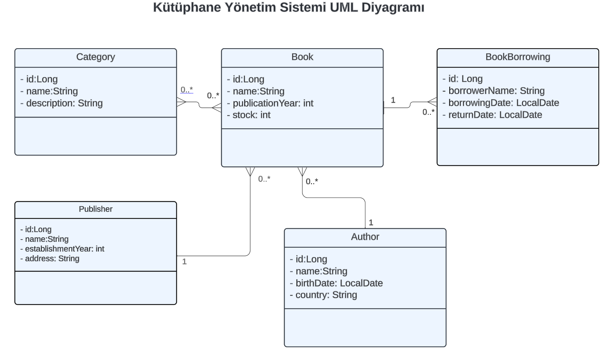
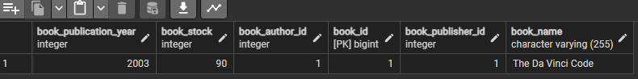
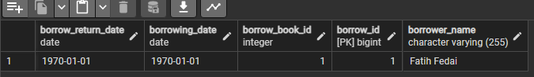

# Library Management System

This project aims to design a library management system. The project is developed in Java using Maven, and PostgreSQL is used as the database.

### Project Description
The project's purpose is to manage books, authors, categories, publishers, and book borrowing operations.

Technologies

- Java
- Maven
- Hibernate (JPA)
- PostgreSQL


## Installation

Install my-project with npm

```bash
git clone https://github.com/Mffedai/Patika-.git
cd Week-10/LibraryManagement
```
### Running the Project

Java and Maven Installation:
Ensure that Java and Maven are installed on your machine since the project is developed in Java and Maven.

PostgreSQL Database Installation:


Install PostgreSQL on your computer and create a database. The project targets a database named library by default.


Properties

```bash
spring.datasource.url=jdbc:postgresql://localhost:5432/library
spring.datasource.username=postgres
spring.datasource.password=postgres
```

Compiling and Running the Project:
In the terminal or command prompt within the project directory, execute the following commands:


```bash
mvn clean install
mvn spring-boot:run
```
## Database Tables


Library Management System Database Diagram

Below are screenshots of the database tables created when the project is run.


#### Author:


#### Book:




#### Book to Category:


#### Borrow:




#### Category:


#### Publisher:


